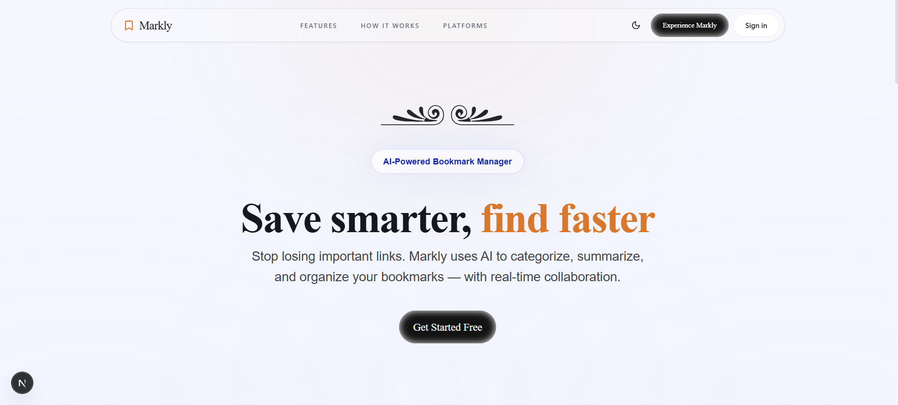

<p align="center">
  
</p>

<h1 align="center">Markly - Smart Bookmark Manager</h1>

<p align="center">
  An AI-powered bookmark manager built with <strong>Next.js 16</strong>, <strong>Supabase</strong>, and <strong>Google Gemini</strong>. Markly helps you organize, share, and intelligently categorize your bookmarks with real-time collaboration, smart collections, and a Chrome extension.
</p>

<p align="center">
  <a href="https://markly-bookmark.vercel.app"><strong>🌐 Live Demo</strong></a>
</p>

<p align="center">
  
</p>

<p align="center">
  <a href="#-tech-stack">Tech Stack</a> •
  <a href="#-features">Features</a> •
  <a href="#-api-endpoints">API</a> •
  <a href="#-deployment">Deployment</a>
</p>

---

## 🛠 Tech Stack

| Layer          | Technology                                          |
|----------------|-----------------------------------------------------|
| Framework      | Next.js 16 (App Router, Turbopack)                  |
| Styling        | Tailwind CSS 3, Framer Motion, Radix UI (shadcn/ui) |
| Backend / Auth | Supabase (PostgreSQL, Auth, Realtime)                |
| AI             | Google Gemini API (`@google/genai`)                  |
| Extension      | Chrome Manifest V3 (Popup + Background Service Worker) |
| Fonts          | DM Sans, DM Serif Display (Google Fonts)             |
| PWA            | Service Worker + Web App Manifest                    |

---

## ✨ Features

- **AI-Powered Organization** — Auto-categorize, tag, and summarize bookmarks using Google Gemini
- **Smart Collections** — AI-generated collections that group bookmarks by topic or theme
- **Real-Time Collaboration** — Share collections with others and see updates via Supabase Realtime
- **Chrome Extension** — Save bookmarks from any page with one click; auto-suggests tags and categories
- **Short URLs** — Generate shareable short links for any bookmark
- **Smart Scheduling** — AI-recommended reading schedules based on your bookmarks
- **Analytics Dashboard** — Track bookmark usage, visit counts, and collection activity
- **Drag & Drop** — Reorder bookmarks within collections using dnd-kit
- **PWA Support** — Install as a native app with offline capabilities
- **Dark Mode** — Full dark theme with next-themes integration

---

## 🔌 API Endpoints

### Chrome Extension APIs

All extension endpoints require a `Bearer` token via the `Authorization` header.

| Method | Endpoint                     | Description                                      |
|--------|------------------------------|--------------------------------------------------|
| POST   | `/api/extension/check-url`   | Check if a URL is already bookmarked             |
| POST   | `/api/extension/save`        | Save or update a bookmark (triggers AI analysis) |
| POST   | `/api/extension/suggest`     | Get AI-suggested tags and category for a URL     |

### Server Actions

| Action              | Description                                          |
|---------------------|------------------------------------------------------|
| `ai-analyze`        | Summarize and analyze a bookmark with AI             |
| `ai-insights`       | Generate AI insights across your bookmark library    |
| `suggest-tags`      | AI-powered tag suggestions for bookmarks             |
| `smart-schedule`    | Generate reading schedules based on bookmarks        |
| `create-bookmark`   | Create a bookmark with metadata fetching             |
| `fetch-metadata`    | Scrape Open Graph metadata from any URL              |
| `share-actions`     | Share bookmarks/collections with other users         |
| `shorten-url`       | Generate short URLs for sharing                      |
| `collection-actions`| Create, update, and manage collections               |
| `import-collection` | Import a shared collection into your library         |
| `record-visit`      | Track bookmark visits for analytics                  |

### Utility

| Method | Endpoint                | Description                                         |
|--------|-------------------------|-----------------------------------------------------|
| GET    | `/api/migrate-shared-by`| One-time migration to add `shared_by` column        |
| GET    | `/s/[code]`             | Redirect to a shared collection via short code      |

---

## 🚀 Deployment

### Prerequisites

- Node.js 18+
- A [Supabase](https://supabase.com) project with Auth and PostgreSQL
- A [Google Gemini API key](https://aistudio.google.com/apikey)

### Environment Variables

Create a `.env.local` file in the project root:

```env
NEXT_PUBLIC_SUPABASE_URL=https://your-project.supabase.co
NEXT_PUBLIC_SUPABASE_ANON_KEY=your-anon-key
GEMINI_API_KEY=your-gemini-api-key
```

### Database Setup

Run the SQL migrations in order from the `supabase/migrations/` folder in the Supabase SQL Editor:

1. `001_initial_schema.sql` — Core tables (bookmarks, collections, profiles)
2. `002_collaboration.sql` — Collection sharing and members
3. `003_ai_enhancements.sql` — AI summary and tag columns
4. `004_analytics.sql` — Visit tracking and analytics
5. `005_short_urls.sql` — Short URL generation
6. `006_ensure_profiles.sql` — Profile auto-creation trigger
7. `007_fix_recursion.sql` — Fix recursive RLS policies
8. `008_add_position_column.sql` — Drag & drop ordering
9. `009_shared_bookmarks_rls.sql` — Shared bookmark access policies

### Deploy to Vercel

1. Push your repo to GitHub
2. Import the project in [Vercel](https://vercel.com)
3. Add the environment variables above in the Vercel dashboard
4. Deploy — Vercel auto-detects Next.js and builds with Turbopack

---

## Getting Started

```bash
# Install dependencies
npm install

# Create .env.local with your Supabase and Gemini keys
cp .env.example .env.local

# Start the dev server
npm run dev

# Production build
npm run build
npm start
```

### Required Environment Variables

```env
NEXT_PUBLIC_SUPABASE_URL=https://your-project.supabase.co
NEXT_PUBLIC_SUPABASE_ANON_KEY=your-anon-key
GEMINI_API_KEY=your-gemini-api-key
```

---

## Problems Encountered & Solutions

### 1. Supabase Error Objects Logging as `{}`

**Problem:** When Supabase returned errors during bookmark or collection fetches, `console.error("Error:", error)` logged `{}` — making debugging impossible.

**Root Cause:** Supabase error objects have non-enumerable properties, so `JSON.stringify()` and `console.error()` produce `{}`.

**Solution:** Extract the `.message` property explicitly before logging:
```ts
// Before (unhelpful)
console.error("Error fetching bookmarks:", error);

// After (informative)
const message = error?.message || (typeof error === 'string' ? error : "Unknown error");
console.error("Error fetching bookmarks:", message, error);
```
**Files:** `use-bookmarks.ts`, `use-collections.ts`

---

### 2. CORS / SSL Handshake Failures (525 Error)

**Problem:** All Supabase API requests blocked with `Access-Control-Allow-Origin Missing Header` and HTTP 525 (SSL Handshake Failed).

**Root Cause:** This was a Supabase infrastructure issue — the project was paused or experiencing a transient Cloudflare SSL outage. Not a code bug.

**Solution:** Checked the Supabase dashboard, verified the project was active by hitting the REST endpoint directly (`/rest/v1/` returns "No API key" when healthy). The CORS error resolved once the project resumed.

**Lesson:** Always check the Supabase dashboard status before debugging CORS issues — a paused project returns no headers at all, which Chrome reports as a CORS violation.

---

### 3. Framer Motion `useScroll` Console Warning

**Problem:** Console warned that `useScroll` with a `target` ref required a non-static positioned scrollable ancestor. The `SectionHeader` component used `useScroll`/`useTransform` for scroll-linked animations.

**Solution:** Replaced the `useScroll`/`useTransform` approach with `whileInView` animations:
```tsx
// Before
const { scrollYProgress } = useScroll({ target: ref, offset: [...] });
const y = useTransform(scrollYProgress, [0, 1], [60, 0]);

// After
<motion.div
    initial={{ opacity: 0, y: 40 }}
    whileInView={{ opacity: 1, y: 0 }}
    viewport={{ once: true, margin: "-80px" }}
/>
```
**File:** `app/page.tsx` (SectionHeader component)

---

### 4. Next.js Image Aspect Ratio Warning

**Problem:** Next.js warned about `motif.svg` image potentially losing its aspect ratio when `width` and `height` props differed from the intrinsic size.

**Solution:** Added `style={{ width: "auto", height: "auto" }}` to the `Image` component to let CSS maintain the aspect ratio.

**File:** `app/page.tsx`

---

### 5. `createCollection` Missing Argument — Build Failure

**Problem:** `npm run build` failed with "Expected 3 arguments, but got 2" in `AICollectionDialog.tsx`.

**Root Cause:** The `createCollection` function in `@/lib/data/collections.ts` requires `(userId, name, description)`, but `AICollectionDialog.tsx` was calling it directly from the data layer without the `userId`.

**Solution:** Fetched the authenticated user's ID inside the component and passed it:
```ts
const [userId, setUserId] = useState<string | null>(null);
useEffect(() => {
    createClient().auth.getUser().then(({ data }) => setUserId(data.user?.id ?? null));
}, []);

// Then in handleCreate:
const newCol = await createCollection(userId!, s.name, s.description);
```
**File:** `AICollectionDialog.tsx`

---

### 6. Auth Page Font Inconsistency

**Problem:** The auth page had "Markly" in DM Serif Display (`font-serif`) and "Welcome back" in DM Sans (`font-sans`), creating a jarring visual mismatch.

**Solution:** Changed the "Welcome back" heading to use `font-serif` to match the Markly branding, creating a unified elegant look on the auth page.

**File:** `app/auth/page.tsx`

---

### 7. Form Accessibility Warnings (Chrome Issues Panel)

**Problem:** Chrome flagged multiple form fields missing `id`, `name`, `autocomplete`, and `<label>` associations — affecting autofill and screen reader support.

**Solution:** Added proper attributes to all form inputs across the dashboard without changing functionality:
- Share link inputs: `id`, `name`, `aria-label`
- Email inputs: `id`, `name`, `type="email"`, `autoComplete="email"`, `aria-label`
- Rename inputs: `aria-label`
- Search input: `name`, `autoComplete="off"`

**Files:** `ShareCollectionDialog.tsx`, `MultiShareDialog.tsx`, `BookmarkCard.tsx`, `dashboard/page.tsx`

---

### 8. PWA Service Worker Cache Staleness (404 Errors)

**Problem:** After deployments, the Service Worker served stale cached files, causing persistent 404 errors preventing the app from loading.

**Solution:** Updated the Service Worker configuration to properly bust caches on new deployments and instructed users to clear browser cache and restart the dev server.

---

### 9. Supabase Realtime Subscription — Shared Collection Empty State

**Problem:** Shared collections appeared empty for recipients even though bookmarks were correctly linked in the database.

**Root Cause:** The query for shared collections wasn't joining through the `collection_members` table to include collections where the user was a member but not the owner.

**Solution:** Updated `getCollections()` to fetch both owned collections AND collections where the user is a member via the `collection_members` table, then merge them.

**File:** `lib/data/collections.ts`

---

### 10. Chrome Extension — Popup TypeError & Icon Loading

**Problem:** The Chrome extension popup threw "Cannot read properties of undefined" errors, and extension icons failed to load.

**Root Cause:** The popup tried to access Supabase session data before it was available, and icon paths in `manifest.json` pointed to non-existent files.

**Solution:** Added null checks for session data before accessing properties, and fixed icon paths in the manifest to reference the correct assets.

---

### 11. Share Dialog — Selected Bookmarks Bug

**Problem:** When sharing bookmarks from a selection, the share dialog would show incorrect or empty bookmark lists.

**Root Cause:** The selected bookmark IDs weren't being correctly passed through the component props chain.

**Solution:** Ensured the `selectedIds` Set was correctly propagated to the `MultiShareDialog` component and used to filter the bookmark list.

**Files:** `MultiShareDialog.tsx`, `dashboard/page.tsx`

---

### 12. Recipient Lookup Failure in Share Actions

**Problem:** Sharing a collection by email failed silently when the recipient had no profile row.

**Solution:** Updated the share action to query the `auth.users` table via a server-side function when the profile lookup returned null, falling back to the auth email.

**File:** `app/actions/share-actions.ts`

---

### 13. Global Font Not Applied to Body

**Problem:** Despite importing DM Sans in `globals.css` and configuring it in Tailwind, some elements (especially buttons and form inputs) rendered in browser-default fonts.

**Root Cause:** The `<body>` element in `layout.tsx` didn't have the `font-sans` class, so child elements without explicit font classes fell back to browser defaults.

**Solution:** Added `font-sans` to the `<body>` className in `layout.tsx`:
```tsx
<body className="font-sans bg-ambient-site min-h-screen">
```
**File:** `app/layout.tsx`

---

## Project Structure

```
markly-next/
├── src/
│   ├── app/                  # Next.js App Router pages
│   │   ├── auth/             # Authentication page
│   │   ├── dashboard/        # Main dashboard
│   │   ├── api/              # API routes (extension, migration)
│   │   ├── actions/          # Server actions (AI, sharing)
│   │   └── s/[code]/         # Public shared collection view
│   ├── components/
│   │   ├── dashboard/        # Dashboard-specific components
│   │   └── ui/               # shadcn/ui base components
│   ├── hooks/                # Custom React hooks
│   ├── lib/
│   │   ├── data/             # Data access functions (Supabase)
│   │   └── supabase/         # Supabase client setup
│   └── types/                # TypeScript type definitions
├── public/                   # Static assets, PWA manifest
└── extension/                # Chrome extension (Manifest V3)
```

---

For issues or questions:

- Open an issue on GitHub
- Check the [documentation](docs/)
- Review the [API guide](API_GUIDE.md)

Ekky Spurgeon – spurgeonpaul11@outlook.com

---

## 🎯 Roadmap

- [x] AI-powered bookmark categorization & tagging
- [x] Real-time collaboration with Supabase Realtime
- [x] Chrome Extension (Manifest V3)
- [x] PWA with offline support
- [x] Short URL generation & sharing
- [x] Analytics dashboard
- [ ] CI/CD pipeline
- [ ] Kubernetes deployment
- [ ] Firefox & Edge extension support
- [ ] Mobile app (React Native)

---

<div align="center">

**Made with ❤️ using Next.js, Supabase, and Google Gemini**

⭐ Star this repo if you find it helpful!

</div>
